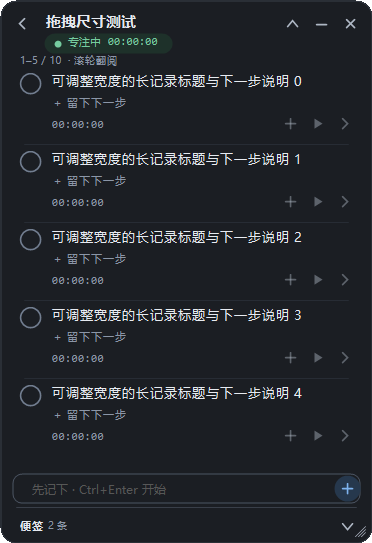

# 浮记 Floating Tasks

把下一步放在眼前。一个本地运行的 Windows 悬浮任务、计时与便签工具，使用 C#、.NET Framework 和 WinForms 构建。

## 功能

- 无边框悬浮卡片，可置顶、调整透明度、拖动位置和调整大小。
- 拖动主面板右边、底边或右下角调整宽高；拉高显示更多记录，尺寸自动保存。
- 任务、记录和小步骤，支持完成、恢复、删除撤销及“下一步”提示。
- 单项专注或并行计时；折叠为一行、隐藏到托盘时继续计时。
- 独立便签，支持多行编辑、历史列表和撤销删除。
- 本地 JSON 存储、原子保存、备份恢复与导入导出。
- 可选的本地 MCP 接口，供支持 stdio 的客户端管理任务和便签。

## 构建与运行

准备一台装有 .NET Framework 4.x 和 Windows PowerShell 5.1 或 PowerShell 7 的 64 位 Windows 电脑。构建脚本使用系统中的编译器：

~~~text
%WINDIR%\Microsoft.NET\Framework64\v4.0.30319\csc.exe
~~~

不需要安装 NuGet 包。下载或克隆仓库后，在项目目录运行：

~~~powershell
powershell.exe -NoProfile -ExecutionPolicy Bypass -File .\build.ps1
~~~

构建会生成：

- 浮记.exe：桌面程序，双击运行。
- FloatingTasks.Mcp.exe：可选 MCP 桥接程序。

更新程序前，请从旧版菜单选择“退出并暂停”，再运行新版。用户数据保存在 %LOCALAPPDATA%\FloatingTasks，不在仓库目录内。

## 基本操作

| 操作 | 方法 |
| --- | --- |
| 记下事项 | 输入后按 Enter；首次使用默认不立即计时 |
| 记下并开始 | Ctrl+Enter |
| 移动窗口 | 拖动顶部 |
| 调整大小 | 拖动主面板右边、底边或右下角 |
| 恢复默认大小 | 主面板右键菜单 |
| 折叠与展开 | 顶部箭头 |
| 隐藏与恢复 | 顶部横线隐藏；双击托盘图标恢复 |
| 退出 | 顶部 × 或菜单“退出并暂停” |

已有用户的 Enter 与计时偏好会保留。详细说明见 [使用说明](使用说明.md)。

## 验证

~~~powershell
powershell.exe -NoProfile -ExecutionPolicy Bypass -File .\build.ps1 -Test
powershell.exe -NoProfile -ExecutionPolicy Bypass -File .\tests\McpStdio.ps1
~~~

第二条命令需要先执行正式构建。测试覆盖计时、撤销、完成与恢复、JSON 存储、MCP 协议、窗口布局、拖拽尺寸、尺寸恢复及 DPI 缩放，使用隔离测试数据。

测试报告和演示截图位于 artifacts/；该目录不提交到仓库。界面测试需要可用的 Windows 桌面环境。

## MCP 接入

将两个生成的 EXE 放在同一目录。参考 [mcp.config.example.json](mcp.config.example.json)，把示例 command 改为你电脑上 FloatingTasks.Mcp.exe 的绝对路径，并合并到客户端配置。

该接口仅面向同一台 Windows 电脑、同一用户及登录会话，使用 stdio 与本地命名管道。具体工具与示例见 [MCP 接入说明](MCP接入说明.md)。

## 项目结构

~~~text
src/
  Application/     任务会话、计时与保存时机
  Domain/          数据模型
  Persistence/     JSON 校验、保存与恢复
  UI/              窗口、绘制、交互和尺寸调整
  Mcp/             MCP 协议、工具与本地桥接
tests/             行为、协议和界面检查
assets/            应用图标
docs/images/       仅使用测试数据的演示截图
build.ps1          构建和测试入口
app.manifest       Windows DPI 设置
~~~

架构与维护约定见 [ARCHITECTURE.md](ARCHITECTURE.md)。首次上传方法见 [上传准备.md](上传准备.md)。

仓库只包含源代码、测试和文档。可执行程序应从源码构建，或由维护者另外作为 GitHub Release 附件发布。